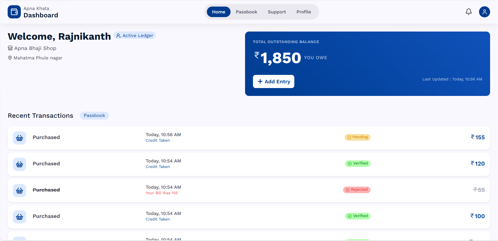
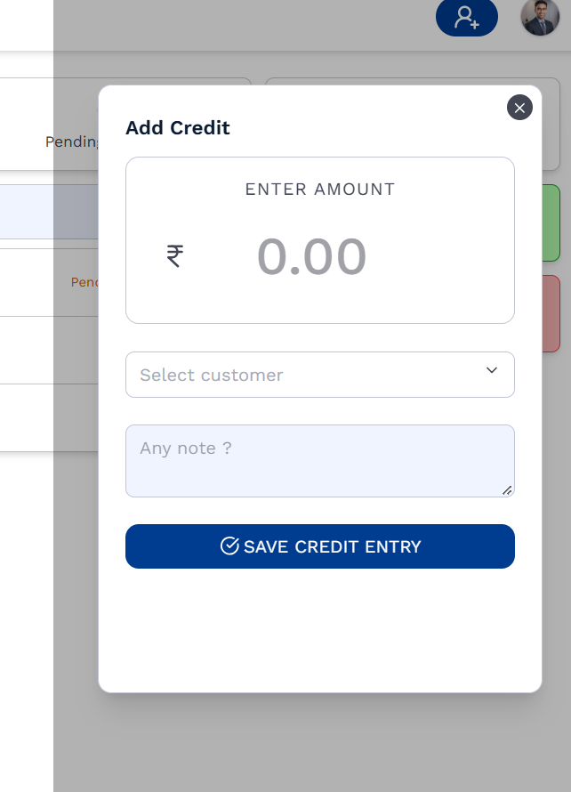
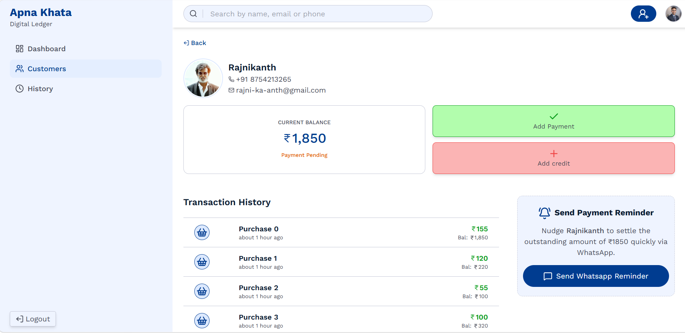

# 📒 Apna Khata

> A digital credit ledger (udhari khata) built for a vegetable shop owner, to replace the paper notebook he used to track customer credit.

🔗 **Live demo:** [https://apnakhataa.vercel.app/]  
⚠️ *The backend is on a free tier, so the first request may take ~30 seconds to wake up.*



---

## The problem
A vegetable shop owner sells to many regular customers on credit (udhari) and tracks every entry in a paper notebook. That caused daily problems:

- ✍️ **The pen runs out or stops writing** in the middle of a busy hour, and entries get missed.
- 🔍 **The pen gets lost**, so entries wait or get noted from memory.
- 💧 **The paper can get wet** in a vegetable shop and the ink spreads or the page tears.
- 📚 **Managing many customers in one notebook is a headache.** Finding one customer's history means flipping through pages.
- ❓ **Disputes** ("I didn't buy that") are hard to settle without a clear record.

## The solution
Apna Khata gives the shop owner one place to manage every customer's credit. Customers can see their own balance and history, and the owner stays in control of what gets confirmed.

## Two roles

### 👤 Customer
- Create a new account and log in
- See their own balance-first dashboard
- Add a **purchase entry**. It stays **Pending** until the shop owner verifies it.
- View their full history (infinite scroll)

### 🛠️ Admin (shop owner)
- Manage customers
- **Verify or reject** pending entries (for example, a wrong entry)
- **Add a verified entry directly.** It also shows on that customer's dashboard.
- **Add payments.** Only the admin can add a payment.
- View each customer's ledger

## Entry workflow
```
Customer adds purchase  →  Pending  →  Admin verifies  →  Verified (counted in balance)
                                    →  Admin rejects   →  Rejected (wrong entry)

Admin adds entry directly  →  Verified (shown on customer's dashboard)
Admin adds payment         →  Reduces customer's balance
```

## Screenshots
| Customer dashboard | Add purchase entry | Admin ledger |
|---|---|---|
|  |  |  |

## Tech stack
| Layer | Tech |
|---|---|
| Frontend (customer) | React, Tailwind CSS, [Vite] |
| Admin panel | React, Tailwind CSS |
| Backend | Node.js, Express.js |
| Database | MongoDB (Mongoose) |
| Auth | JWT with httpOnly cookies |
| Deployment | Vercel (frontend), Render (backend) |

## Author
**Firoj Shaikh** · Full Stack Developer (MERN) · Pune, India
[LinkedIn](https://www.linkedin.com/in/ifirojshaikh) · [Email](mailto:firoj2108@gmail.com)
